# Documentação Enem Auto Correction

Inicialmente, serão fornecidos detalhes fundamentais sobre o corpus utilizado, o Essay-
BR, que abrange uma ampla variedade de documentos argumentativos coletados ao longo
de vários anos e anotados com notas relativas às competências da redação do ENEM. Esses
detalhes incluem o número de redações, competências avaliadas e a faixa de notas finais. A
análise do conjunto de dados destacará padrões de distribuição, evidenciando a frequência
de notas e a concentração em determinados intervalos.

Em seguida, serão apresentadas as especificações do modelo adotado, treinamento e
resultados obtidos, tanto para modelos de classificação quanto para regressão. A abordagem
de treinamento, a quebra do conjunto de dados e a escolha de hiperparâmetros serão
discutidas em detalhes. Além disso, a interface web desenvolvida para a aplicação prática
dos modelos será descrita, destacando sua funcionalidade e integração com os modelos de
correção automática.

## Enem Corpus

O Corpus Essay-BR contém 4570 documentos argumentativos e 86 tópicos. As re-
dações foram coletadas de Dezembro de 2015 até Abril de 2020. Os tópicos incluem:
questões políticas, atividades culturais, covid-19, movimentos populares dentre outros.
Todos os documentos estão anotados com notas relativas as 5 competências da Redação
do ENEM.

Cada redação do nosso Corpus possui: Título, texto da redação, 5 notas relativas a
avaliação de cada competência e nota final.

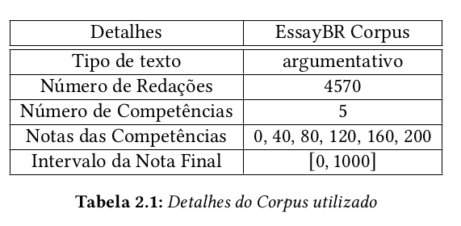

## Análise do Conjunto de Dados

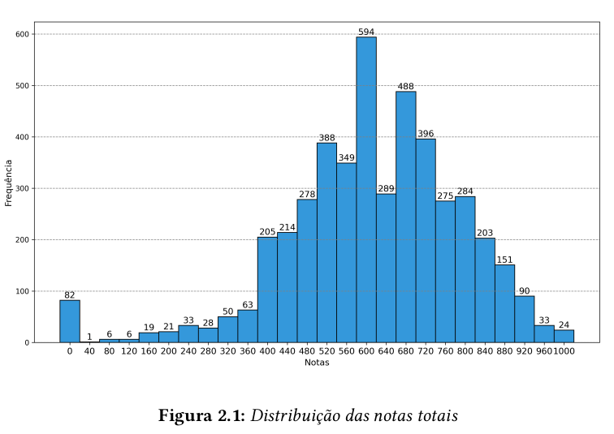

Segundo a observação da Figura 2.1 as quatro notas que apresentam a maior frequência
são respectivamente: 600, 680, 720 e 520, correspondendo a 13,00%, 10,68%, 8,67% e 8,49%
do corpus. As 4 notas agrupadas apresentam aproximadamente 40% do corpus. Isso indica
que essas pontuações devem aparecer mais vezes nos conjuntos de treinamento, validação
e teste. Além disso, as pontuações no corpus têm uma distribuição normal levemente
inclinada para a direita.

A tabela 2.2 exibe a distribuição das notas por competências:

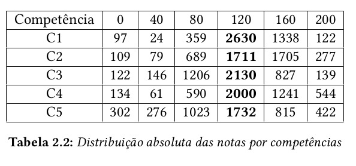

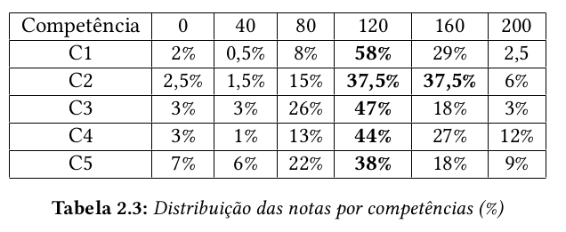

A partir da tabela tabela 2.3 é possível perceber que há uma alta frequência na nota 120,
já as notas do extremo (0 e 200) possuem uma baixa concentração de redações do Corpus
utilizado.

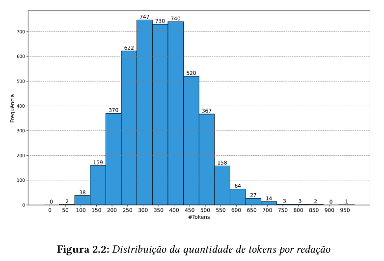

Como o BERT usa um tokenizador de subpalavras (WordPiece), em que o comprimento
máximo corresponde a 512 tokens de subpalavras, a partir da Figura 2.2 é possível visualizar
que parte do nosso conjunto de dados de treino terá parte da redação perdida.

## Modelo

O modelo treinado partiu do carregamento do pré-treino do modelo "neuralmind/bert-
base-portuguese-cased" localizado no Hugging Face, as especificações do tokenizador uti-
lizado foram: max_length=512, truncation="longest_first" e padding="max_length". Para
treinar o modelo utilizamos várias abordagens sendo elas classificação e regressão. Para
avaliar o desempenho dos diferentes modelos utilizamos as métricas de acurácia e Qua-
dratic Cohen Kappa para a classificação e MAE, RMSE e Quadratic Cohen Kappa para a
regressão.

## Treino

Para realizar o treinamento realizamos uma quebra do nosso conjunto de dados de
forma que o conjunto de treino ficou com aproximadamente 70% dos dados, e o conjunto
de validação e teste com 15% cada. A separação entre esses conjuntos foi feita de forma
a preservar a distribuição de notas do Corpus original, como é possível de verificar nas
Figuras 2.3, 2.4 e 2.5.

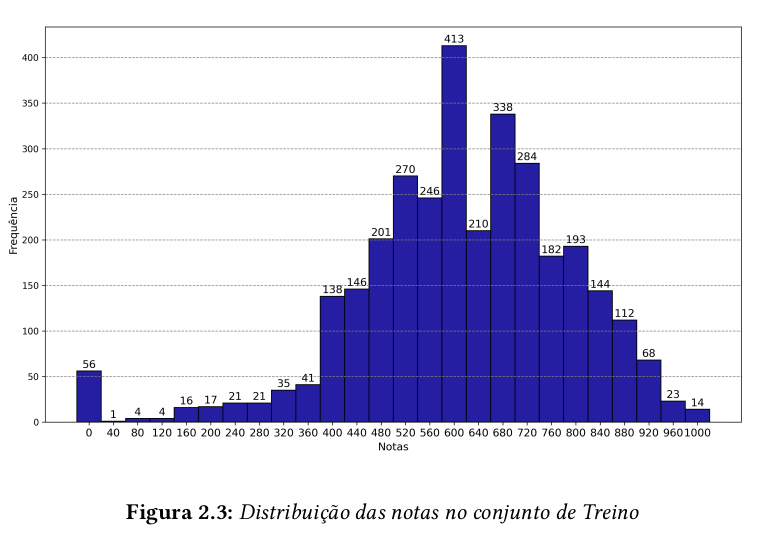

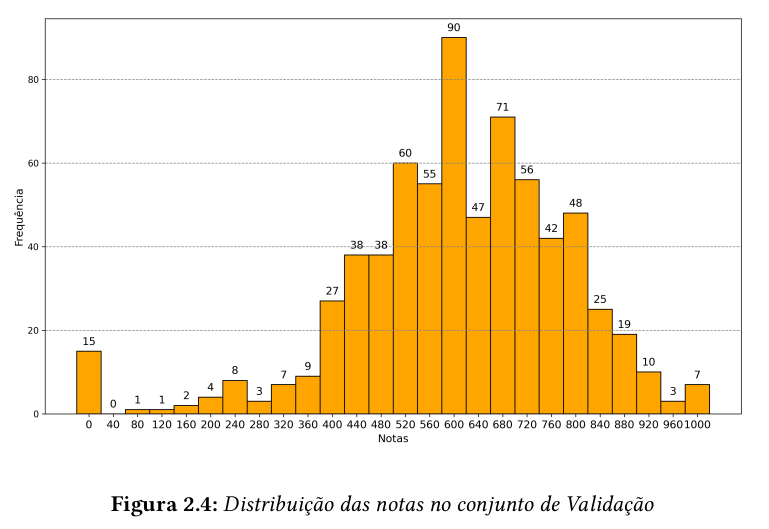

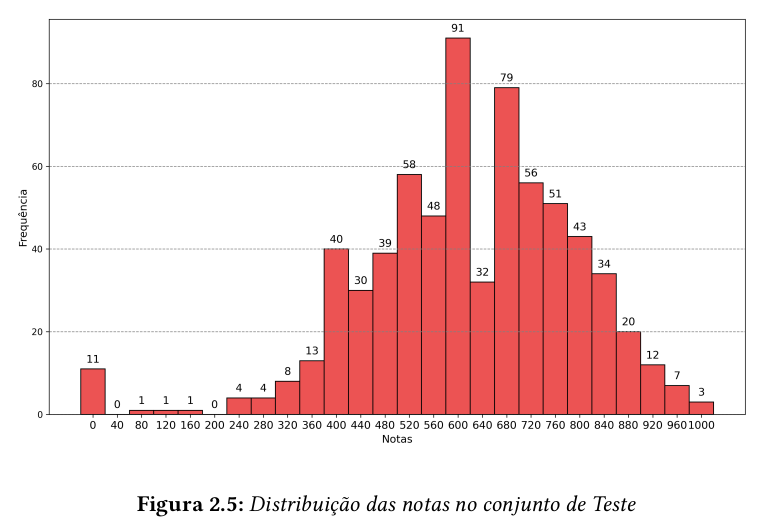

## Experimentos

A estratégia foi utilizar o texto completo da redação para predizer a nota final, conside-
rando todas as competências ao mesmo tempo. Foram feitos experimentos com modelos
de Regressão e Classificação. Para os modelos de Classificação foram realizados cortes de
acordo com a distribuição dos dados.

Os agrupamentos de intervalos realizados para os modelos de Classificação no conjunto
de Treino foram:

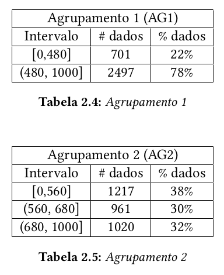

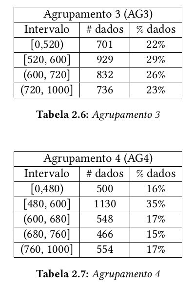

Os hiperparâmetros utilizados para o treinamento dos modelos foram:
- Batch size: 8
- Number of epochs: 4
- Polynomial Decay: initial_learning_rate=5e-5
- Classification Loss: SparseCategoricalCrossentropy27
- Regression Loss: MeanSquaredError

Os resultados obtidos no conjunto de validação foram:

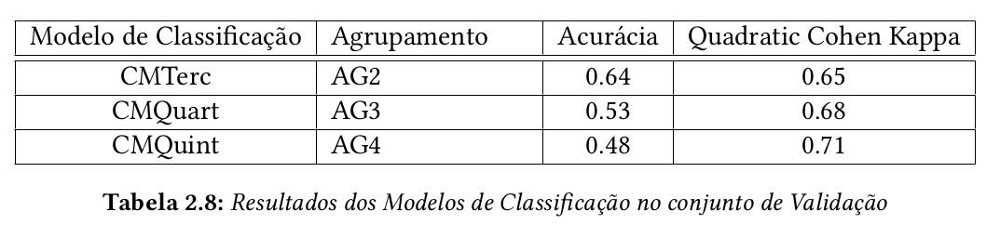

A partir da Tabela 2.8 é possível observar que o modelo CMTerc apresentou uma
acurácia de 0.64 e QCK de 0.65, sendo a maior acurácia dentre os demais modelos. Já o
modelo CMQuint apresentou uma acurácia de 0.48 e QCK de 0.71, sendo o maior QCK
dentre os demais.

Observando o modelo CMTerc e o seu treinamento obtemos:

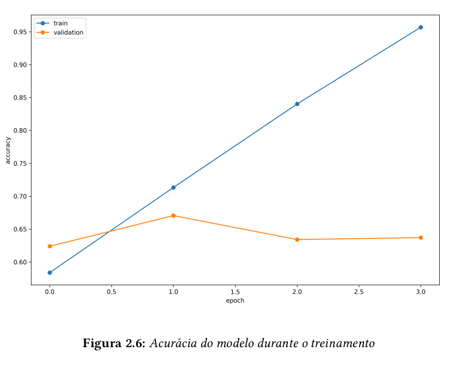

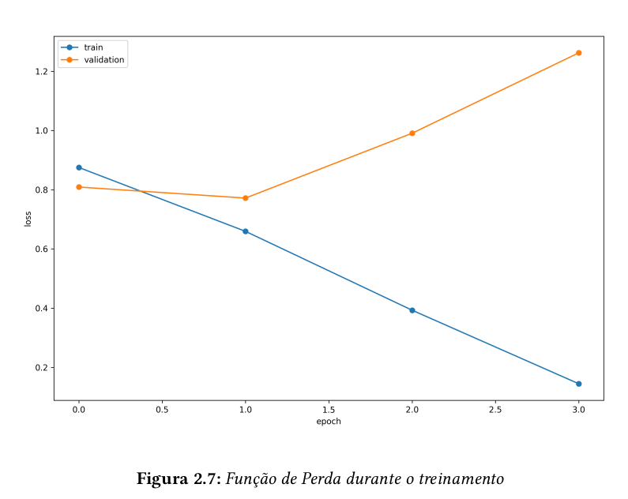

É possível observar a partir das Figuras 2.6 e 2.7 que com poucas épocas o modelo já
apresentou um excelente resultado no conjunto de treinamento e começou a diminuir a
capacidade de generalização.
Para os modelos de Regressão os resultados obtidos no conjunto de validação fo-
ram:

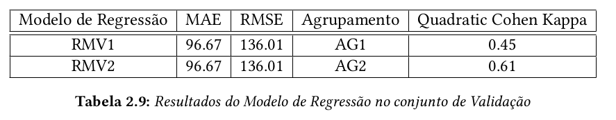

A partir da Tabela 2.9 é possível observar que no Agrupamento AG2 o modelo apresenta
o maior QCK, sendo 0.45 no AG1 e 0.61 no AG2.

Para poder comparar a performance dos modelos de Classificação com os de Regressão,
a partir das probabilidades obtidas pelos modelos de Regressão padronizamos o intervalo
de output para [0, 1000] e consideramos o piso do valor obtido para determinar em qual in-
tervalo do agrupamento ele pertence, dessa forma é possível utilizar a métrica de Quadratic
Cohen Kappa e comparar ambos os modelos.

A partir dos resultados dos modelos treinados acima decidimos escolher o modelo
RMV2 como nosso modelo final, pois dentre os modelos de regressão foi o que apresentou o
melhor QCK. Em relação ao modelo CMTerc o seu QCK é bem próximo e temos a vantagem
da predição direta da nota final, sem ser como os modelos de classificação que indicam um
intervalo na qual a nota se encontra.

A partir dos resultados dos modelos treinados acima, optamos por eleger o modelo
RMV2 como nosso modelo final. Dentre os modelos de regressão avaliados, apresentou o
maior QCK. Em relação ao modelo CMTerc, observamos que seu índice QCK é bastante
similar; contudo, desfrutamos da vantagem associada à capacidade de realizar previsões
diretas para a nota final, diferentemente dos modelos de classificação, que indicam um
intervalo para a predição da nota.

Os resultados do Modelo Final RMV2 obtidos no conjunto de teste foram:

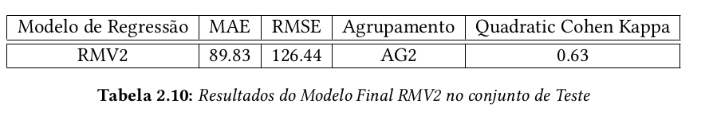

A partir da Tabela 2.10 é possível observar que no conjunto de teste o Modelo Final
RMV2 apresentou um QCK de 0.63, que é um aumento de 20% de performance na métrica
de QCK em relação as pesquisas anteriores de Amorim e Veloso, 2017 (QCK de 0.47) e
Fonseca et al., 2018 (QCK de 0.51).

